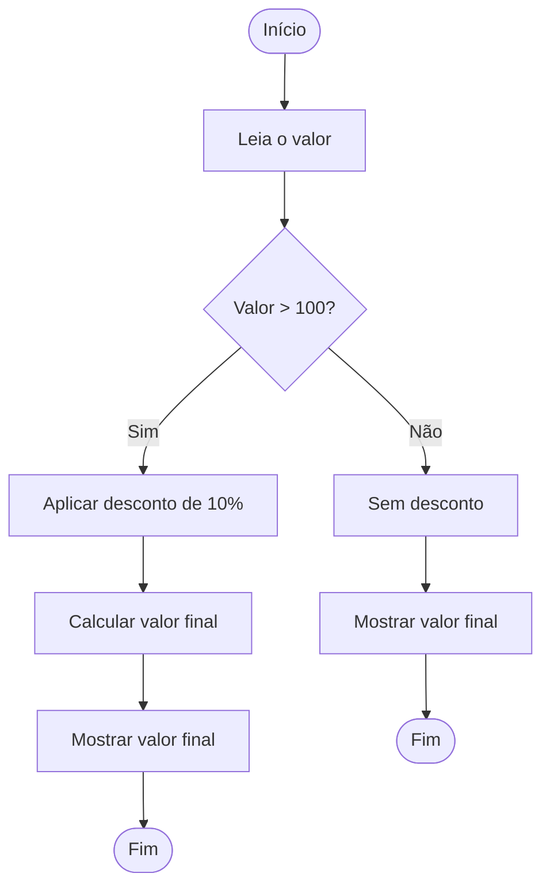

```mermaid
flowchart TD
    A([Início]) --> B[Leia o valor]
    B --> C{Valor > 100?}
    C -- Sim --> D[Aplicar desconto de 10%]
    D --> E[Calcular valor final]
    E --> F[Mostrar valor final]
    F --> G([Fim])
    C -- Não --> H[Sem desconto]
    H --> J[Mostrar valor final]
    J --> K([Fim])
```
